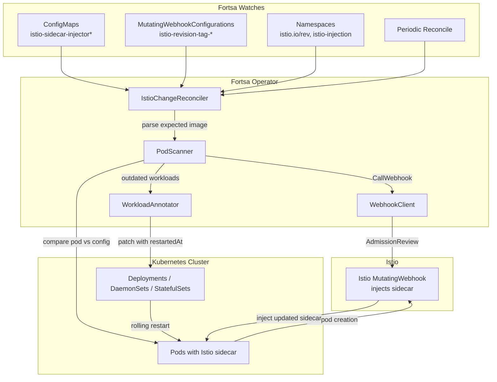
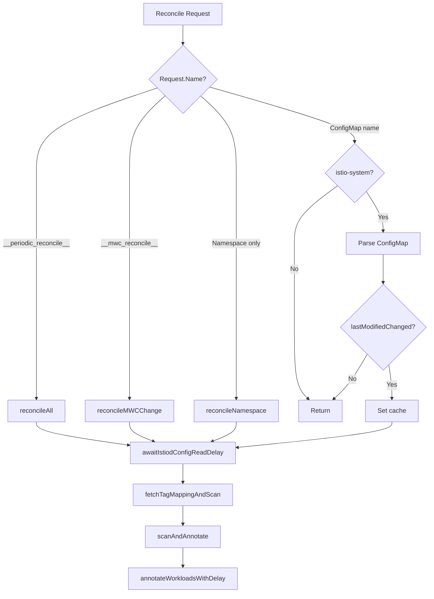
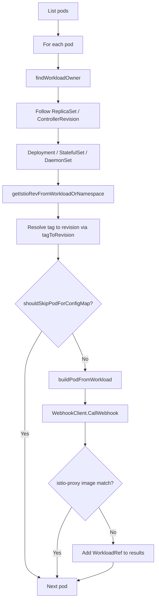

# Fortsa Architecture

This document describes how Fortsa works internally: its components, data flows, and package structure.

## Overview

**Purpose**: Fortsa is a Kubernetes operator that keeps Istio's data-plane up-to-date by automatically restarting workloads with outdated sidecar proxies when Istio configuration changes.

**Design principles**:

- No CRDs; uses only built-in Kubernetes resources
- Minimal dependencies (controller-runtime, k8s.io/client-go)
- Single binary deployed via bare container (FROM scratch)
- No access required outside the cluster

**Key mechanism**: Fortsa adds the `fortsa.scaffidi.net/restartedAt` annotation to Deployments, StatefulSets, and DaemonSets. This triggers a rolling restart of their pods—the same mechanism used by `kubectl rollout restart`. When a pod is recreated, Istio's MutatingWebhook injects the updated sidecar proxy.

## Package Structure

```text
fortsa/
├── cmd/main.go              # Entry point, flag parsing, manager setup
├── internal/
│   ├── cache/               # ConfigMap revision cache for change detection
│   ├── controller/          # IstioChangeReconciler, ConfigMap predicate, reconcile routing
│   ├── mwc/                 # MWC predicates, tag mapping fetch, reconcile request
│   ├── namespace/            # Namespace predicates, reconcile request
│   ├── periodic/            # Periodic reconcile source, reconcile request
│   ├── podscanner/          # Pod scanning, outdated sidecar detection
│   ├── annotator/           # Workload annotation for restarts
│   ├── configmap/           # Istio sidecar injector ConfigMap parsing
│   └── webhook/             # Istio injection webhook client
├── config/                  # Kustomize manifests (RBAC, manager, Prometheus)
├── helm/src/chart/          # Helm chart for deployment
└── test/                    # E2E and integration tests
```

**Package dependency graph**:

```text
controller → annotator, cache, configmap, mwc, periodic, podscanner, webhook
mwc        → (k8s client)
namespace  → (controller-runtime)
periodic   → (controller-runtime)
podscanner → configmap, webhook
annotator  → podscanner
```

## Component Architecture



## Startup Flow

The application starts in [cmd/main.go](cmd/main.go) with the following sequence:

1. **Parse flags**: `--dry-run`, `--compare-hub`, `--restart-delay`, `--istiod-config-read-delay`, `--reconcile-period`, `--annotation-cooldown`, `--skip-namespaces`, TLS paths for webhook and metrics
2. **Register scheme**: `clientgoscheme` and `corev1` for Kubernetes API types
3. **Create Manager**: controller-runtime Manager with leader election (`71f32f9d.fortsa.scaffidi.net`), metrics on `:8080`, health probes on `:8081`
4. **Instantiate components**: `WebhookClient` and `IstioChangeReconciler` (which creates `PodScanner` and `WorkloadAnnotator` internally)
5. **Build controller**: `For(ConfigMap)` with `ConfigMapFilter`, plus `Watches` for MutatingWebhookConfiguration, Namespace, and optional periodic source
6. **Add health checks**: `healthz.Ping` for healthz and readyz
7. **Start manager**: `mgr.Start(ctrl.SetupSignalHandler())`

## Reconcile Flow

The `Reconcile` method in [internal/controller/istio_change_reconciler.go](internal/controller/istio_change_reconciler.go) routes requests by type:



**Request types**:

| Request | Trigger | Handler |
| ------- | ------- | ------- |
| `__periodic_reconcile__` | Periodic ticker | `reconcileAll()` — full scan of all ConfigMaps |
| `__mwc_reconcile__` | MWC change | `reconcileMWCChange()` — refresh tag mapping, scan |
| Namespace-only (no namespace in req) | Namespace label change | `reconcileNamespace()` — scan only that namespace |
| ConfigMap in `istio-system` | ConfigMap change | Standard ConfigMap reconcile (parse, cache check, delay, scan) |

All paths converge on `fetchTagMappingAndScan()` → `scanAndAnnotate()` → `annotateWorkloadsWithDelay()`.

## Per-Pod Outdated Detection Flow

The PodScanner in [internal/podscanner/pod_scanner.go](internal/podscanner/pod_scanner.go) determines whether a pod has an outdated Istio sidecar:



**Steps**:

1. **List pods** — Optionally limited by namespace (e.g., for namespace-scoped reconciliation)
2. **findWorkloadOwner** — Follow ownerReferences: Pod → ReplicaSet/ControllerRevision → Deployment/StatefulSet/DaemonSet
3. **getIstioRevFromWorkloadOrNamespace** — Get `istio.io/rev` from workload pod template, or from namespace (`istio.io/rev` or `istio-injection=enabled`); returns `"default"` when namespace has `istio-injection=enabled`
4. **Resolve tag → revision** — Use `tagToRevision` map from `istio-revision-tag-*` MWCs
5. **shouldSkipPodForConfigMap** — Skip if pod was created after ConfigMap/MWC lastModified + IstiodConfigReadDelay (pods created after config update may already have correct sidecar)
6. **buildPodFromWorkload** — Construct a Pod from the workload's pod template
7. **WebhookClient.CallWebhook** — Send AdmissionReview to Istio `/inject`, get mutated pod with expected sidecar
8. **Compare images** — Extract `istio-proxy` image from current pod and from webhook response; compare (optionally including registry via `--compare-hub`)
9. **If mismatch** — Add WorkloadRef to results for annotation

## Webhook Client

[internal/webhook/webhook_client.go](internal/webhook/webhook_client.go) calls the Istio sidecar injection webhook to determine the expected pod shape:

- **URL and caBundle**: Read from `istio-sidecar-injector` or `istio-sidecar-injector-<revision>` MutatingWebhookConfiguration; for default tag, prefers `istio-revision-tag-default` if it exists
- **Request**: Sends `AdmissionReview` with the pod (built from workload template) to the webhook's `/inject` path
- **Response**: Applies the JSON patch from the response to obtain the mutated pod, then extracts the expected `istio-proxy` container image
- **Revisions**: Supports both default revision (`istiod.istio-system.svc`) and revision-specific (`istiod-<revision>.istio-system.svc`)

## ConfigMap Parser

[internal/configmap/configmap_parser.go](internal/configmap/configmap_parser.go) parses Istio sidecar injector ConfigMaps:

- **Input**: ConfigMap with `values` key containing JSON (e.g., `istio-sidecar-injector`, `istio-sidecar-injector-default`)
- **Extracts**: `Revision`, `Hub`, `Tag`, `Image` (global.proxy.image) from the values JSON; revision can also come from ConfigMap label `istio.io/rev`
- **LastModified**: Uses `metadata.managedFields` timestamps when available; falls back to `creationTimestamp`

## Workload Annotator

[internal/annotator/workload_annotator.go](internal/annotator/workload_annotator.go) triggers rolling restarts:

- **Annotation**: Patches `spec.template.metadata.annotations` with `fortsa.scaffidi.net/restartedAt` (RFC3339 timestamp) via JSON merge patch
- **Cooldown**: When `annotationCooldown` is set, skips re-annotating if the workload was annotated within that duration
- **Supported kinds**: Deployment, StatefulSet, DaemonSet

## Kubernetes Resources

| Resource | Usage |
| -------- | ----- |
| ConfigMap | Istio sidecar injector config (`istio-sidecar-injector*`) |
| MutatingWebhookConfiguration | Tag mapping (`istio-revision-tag-*`), webhook URL/caBundle |
| Namespace | Istio labels (`istio.io/rev`, `istio-injection`) |
| Pod | Sidecar image comparison |
| Deployment / StatefulSet / DaemonSet | Patched with restartedAt annotation |
| ReplicaSet / ControllerRevision | Owner chain traversal |

## Configuration Flags

| Flag | Default | Description |
| ---- | ------- | ----------- |
| `--dry-run` | false | Log what would be done without annotating workloads |
| `--compare-hub` | false | Require container image registry to match ConfigMap hub when detecting outdated pods |
| `--restart-delay` | 0 | Delay between restarting each workload (e.g., 5s) |
| `--istiod-config-read-delay` | 10s | Wait for Istiod to read updated ConfigMap before scanning |
| `--reconcile-period` | 1h | Period between full reconciliations; 0 disables periodic reconcile |
| `--annotation-cooldown` | 5m | Skip re-annotating if workload was annotated within this duration |
| `--skip-namespaces` | kube-system,istio-system | Comma-separated namespaces to skip when scanning pods |

## Cache and Change Detection

The [internal/cache](internal/cache) package provides `RevisionCache`, used by `IstioChangeReconciler` for change detection and pod skip logic:

- **revisionToLastModified**: `revision → LastModified` — Used to detect ConfigMap changes and to skip pods created after the config was updated (with IstiodConfigReadDelay)
- **nameToRevision**: `configMapKey → revision` — Used when a ConfigMap is deleted to clean up the cache
- **LastModifiedChanged()**: Returns true only when the ConfigMap's LastModified differs from the cached value; avoids redundant scans when the same ConfigMap is reconciled again without changes

The cache is protected by a mutex for concurrent access from multiple reconcile workers.
